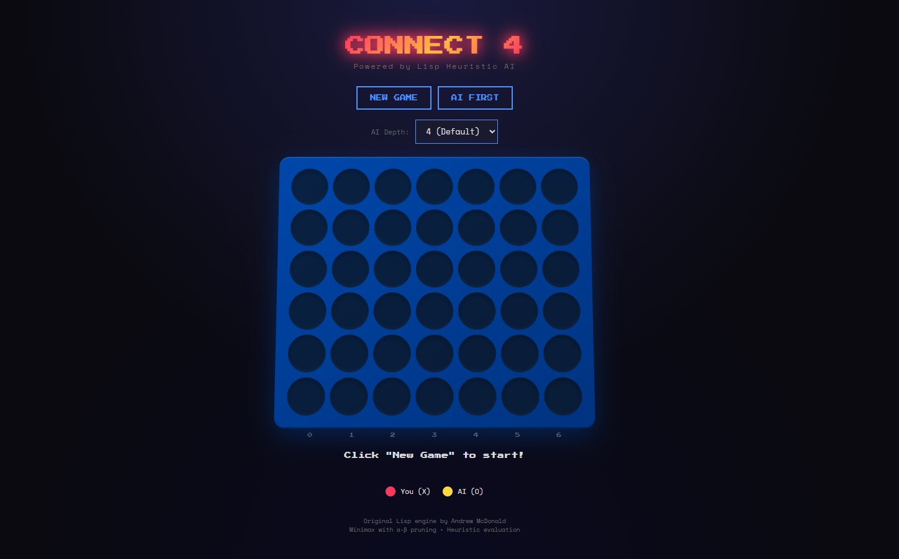

# Connect-4 Heuristic Player - Web Edition

A web interface for the Connect-4 Heuristic AI, powered by Common Lisp.



## Overview

This project wraps the original [Connect4-Heuristic-Player](https://github.com/famesjranko/Connect4-Heuristic-Player) Lisp implementation with a modern web interface. The original game logic, minimax algorithm, and heuristic evaluation remain **completely unchanged** - we've simply added an HTTP API layer on top.

### Architecture

```
┌─────────────────────┐
│   Browser (HTML/JS) │
└──────────┬──────────┘
           │ HTTP/JSON
┌──────────▼──────────┐
│   Hunchentoot       │  ← Web server layer (web-server.lisp)
│   (CL HTTP Server)  │
└──────────┬──────────┘
           │ Function calls
┌──────────▼──────────┐
│  Original Lisp Code │
│  ├─ minimax.lisp    │  ← Minimax with α-β pruning  
│  ├─ connect-4.lisp  │  ← Game logic & board
│  └─ heuristic.lisp  │  ← AI evaluation function
└─────────────────────┘
```

## Quick Start

### Using Docker (Recommended)

```bash
# Build and run
docker compose up --build

# Or just docker
docker build -t connect4-lisp .
docker run -p 8080:8080 connect4-lisp
```

Open http://localhost:8080 in your browser.

### Running Locally (requires SBCL)

```bash
# Install SBCL and Quicklisp first, then:
sbcl --load web-server.lisp
```

## Project Structure

```
connect4-lisp/
├── src/                     # Original Lisp files (UNCHANGED)
│   ├── minimax.lisp         # Minimax algorithm with α-β pruning
│   ├── connect-4.lisp       # Game board, moves, win detection
│   └── heuristic.lisp       # AI heuristic evaluation
├── static/
│   └── index.html           # Web UI (single-file HTML/CSS/JS)
├── images/
│   └── screenshot.jpg       # Game screenshot
├── web-server.lisp          # HTTP API layer (Hunchentoot)
├── Dockerfile
├── docker-compose.yml
└── README.md
```

## API Endpoints

| Endpoint | Method | Description |
|----------|--------|-------------|
| `GET /api/new-game` | GET | Start new game (player first) |
| `GET /api/new-game-ai-first` | GET | Start new game (AI first) |
| `GET /api/move?game_id=X&column=N` | GET | Make a move (column 0-6) |
| `GET /api/game-state?game_id=X` | GET | Get current board state |
| `GET /api/set-depth?depth=N` | GET | Set AI search depth (1-6) |
| `GET /api/health` | GET | Health check |

### Example Response

```json
{
  "board": [[null,null,null,null,null,null], ...],
  "status": "ongoing",
  "aiMove": 3,
  "evaluations": 1234,
  "message": "Your turn"
}
```

## AI Configuration

The AI uses minimax with alpha-beta pruning and a custom heuristic. You can adjust the search depth:

- **Depth 1-2**: Easy (fast, not very strategic)
- **Depth 3-4**: Medium (good balance, default is 4)
- **Depth 5-6**: Hard (slower, very strategic)

The heuristic evaluates:
- **Positional value**: Center columns weighted higher
- **Threat detection**: Imminent win/loss detection
- **Defensive weighting**: Tuned to prioritize blocking

## Original Project

The Lisp game engine is from [famesjranko/Connect4-Heuristic-Player](https://github.com/famesjranko/Connect4-Heuristic-Player) by Andrew McDonald.

The minimax implementation is based on code from "Artificial Intelligence" by Elaine Rich and Kevin Knight (McGraw Hill, 1991).

## Technical Details

- **Lisp Implementation**: SBCL (Steel Bank Common Lisp)
- **Web Server**: Hunchentoot
- **JSON Handling**: cl-json
- **Frontend**: Vanilla HTML/CSS/JS (no frameworks)
- **Container**: Debian Bookworm slim base

## License

Original Lisp code may be freely copied and used for educational or research purposes.
