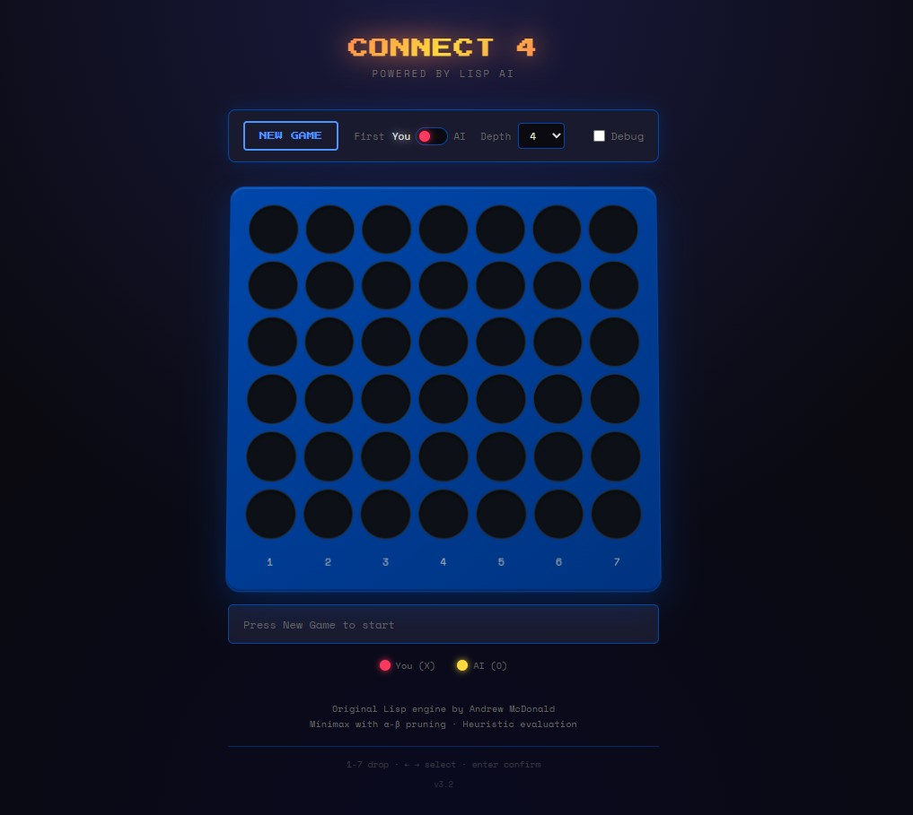

# Connect-4 Lisp Heuristic Player - Web Dashboard



## Overview

This project adds a modern web interface to my original [Connect4-Heuristic-Player](https://github.com/famesjranko/Connect4-Heuristic-Player) Lisp implementation from university. The original heuristic evaluation logic is preserved, while the underlying data structures and search have been optimised for performance (array-based board, transposition table, parallel search).

### Architecture

```
┌─────────────────────────────┐
│     Browser (game UI)       │  ← Holds game token, renders board
└──────────────┬──────────────┘
               │ POST {token, column}
┌──────────────▼──────────────┐
│      Load Balancer          │
├─────────┬─────────┬─────────┤
│ Instance│ Instance│ Instance│  ← Stateless — any instance handles any request
└────┬────┴────┬────┴────┬────┘
     │         │         │
┌────▼─────────▼─────────▼────┐
│        Redis                 │  ← Game state, slot management, TTL expiry
└─────────────────────────────┘
     │         │         │
┌────▼─────────▼─────────▼────┐
│     Lisp AI Engine           │
│  ├─ minimax.lisp            │  ← α-β pruning + transposition table
│  ├─ connect-4.lisp          │  ← Game logic + Zobrist hashing
│  └─ heuristic.lisp          │  ← AI evaluation function
└─────────────────────────────┘
```

### Stateless Design with Redis

The server itself is stateless — all game state lives in Redis:

- **Server owns the board** — clients send a game token, not the full board
- **Redis stores game state** as hashes with TTL-based expiry
- **Game slots** limit concurrent games (default: 4) to prevent resource exhaustion
- **Atomic slot allocation** via Lua scripting prevents race conditions
- **Any server instance** can handle any request — true horizontal scaling

This protects against DoS attacks (no unbounded computation from arbitrary board states) while keeping the server fully stateless and horizontally scalable.

## Quick Start

### Using Docker Compose (recommended)

```bash
# Build and run (includes Redis)
docker compose up --build
```

Open http://localhost:8080 in your browser.

### Cloud Deployment (Railway / Render / Fly.io / Cloud Run)

1. Push to GitHub
2. Connect repo to platform
3. Deploy - auto-detects Dockerfile
4. Provision a Redis instance and set `REDIS_HOST`
5. Scale server instances independently

### Running Locally (requires SBCL + Redis)

```bash
# Start Redis, then:
REDIS_HOST=localhost sbcl --load web-server.lisp
```

### Environment Variables

| Variable | Default | Description |
|----------|---------|-------------|
| `PORT` | 8080 | Server port |
| `LISP_AI_DEPTH` | 3 | Default AI search depth |
| `LISP_AI_MAX_DEPTH` | 6 | Maximum allowed search depth |
| `LISP_AI_THREADS` | 4 | Worker threads for parallel search |
| `REDIS_HOST` | redis | Redis hostname |
| `REDIS_PORT` | 6379 | Redis port |
| `MAX_GAME_SLOTS` | 4 | Maximum concurrent games |
| `HEARTBEAT_TTL_SECONDS` | 90 | Redis key TTL, refreshed by heartbeats |
| `INACTIVITY_TTL_SECONDS` | 1800 | Client-side inactivity timeout (resets on moves) |
| `RATE_LIMIT_REQUESTS` | 10 | Max requests per rate limit window |
| `RATE_LIMIT_WINDOW` | 10 | Rate limit window in seconds |

## Features

- **Redis-backed game slots** — server owns board state, clients hold tokens
- **DoS protection** — capped concurrent games with TTL-based expiry
- **Horizontally scalable** — stateless servers, all state in Redis
- **Theme picker** — 8 themes from minimal to retro arcade
- **Keyboard support** — press 1-7 to drop pieces, arrow keys to select, Enter to confirm
- **Adjustable AI difficulty** (depth 1-8)
- **Debug mode** — see AI's move analysis and scores
- **Winning line highlighting** when game ends
- **Slot availability indicator** — live game count with manual refresh
- **Non-root Docker** container for security

## Themes

The UI supports 8 unique themes, each with its own HTML/CSS. Game logic is shared via `game-client.js`:

```
static/
├── game-client.js  # Shared game logic (token-based API)
├── index.html      # Redirects to modern.html
├── modern.html     # Clean, minimal dark theme
├── arcade.html     # Retro arcade with glows and 3D board
├── terminal.html   # CRT terminal / Lisp REPL aesthetic
├── neon.html       # Cyberpunk pink/cyan neon
├── paper.html      # Light notebook/sketch aesthetic
├── midnight.html   # Space theme with stars and nebula
├── sunset.html     # Warm orange/pink gradients
└── hacker.html     # Matrix digital rain effect
```

Add new themes by creating additional HTML files in `static/`. Each theme contains only HTML and CSS — all game logic lives in `game-client.js`.

## Project Structure

```
connect4-lisp/
├── src/
│   ├── connect-4.lisp       # Game board, moves, win detection, Zobrist hashing
│   ├── heuristic.lisp       # AI heuristic evaluation
│   ├── minimax.lisp         # Minimax with α-β pruning, transposition table, parallel search
│   ├── redis.lisp           # Redis connection, Lua scripts, slot management
│   └── game-store.lisp      # Game lifecycle (create/load/save/end), validation, conditions
├── static/
│   ├── game-client.js       # Shared frontend game logic
│   ├── index.html           # Redirect to default theme
│   └── *.html               # Theme files (8 themes)
├── web-server.lisp          # HTTP API layer (Hunchentoot)
├── Dockerfile
├── docker-compose.yml       # App + Redis
├── test-game-slots.sh       # Integration test suite
└── README.md
```

## API Endpoints

| Endpoint | Method | Description |
|----------|--------|-------------|
| `/api/new-game` | POST | Create a new game (returns token) |
| `/api/move` | POST | Make a move (token + column) |
| `/api/game` | DELETE/POST | Resign / end a game |
| `/api/debug` | POST | Evaluate board without moving |
| `/api/health` | GET | Health check with Redis status and slot count |

### Create Game

```javascript
// POST /api/new-game
// Content-Type: application/json
{
  "depth": 4,
  "aiFirst": false
}
```

```json
// Response 200
{
  "token": "29e48712-2593-4884-83e0-03a8f15246e1",
  "board": [[null,null,...], ...],
  "status": "ongoing",
  "turn": "x",
  "message": "Your turn!"
}

// Response 503 (slots full)
{
  "error": "slots_full",
  "message": "All game slots are in use. Try again shortly."
}
```

### Make Move

```javascript
// POST /api/move
// Content-Type: application/json
{
  "token": "29e48712-2593-4884-83e0-03a8f15246e1",
  "column": 3
}
```

```json
// Response 200
{
  "board": [[null,null,...], ...],
  "status": "ongoing",
  "aiMove": 2,
  "aiScores": [[0, 12], [1, 8], [2, 15], ...],
  "evaluations": 1234,
  "immediateWin": null,
  "immediateBlock": 4,
  "winningCells": null,
  "message": "Your turn!"
}
```

### Error Responses

| Status | Error Code | When |
|--------|-----------|------|
| 400 | `invalid_column` | Column not 0-6 |
| 400 | `column_full` | Column has no space |
| 404 | `game_not_found` | Invalid or expired token |
| 405 | `method_not_allowed` | Wrong HTTP method |
| 409 | `game_over` | Move on finished game |
| 429 | `rate_limited` | Too many requests (per-IP) |
| 503 | `slots_full` | All game slots occupied |

### Health Check

```json
{
  "status": "ok",
  "version": "1.0",
  "redis": "connected",
  "activeGames": 2,
  "maxGames": 4
}
```

## Redis Schema

| Key | Type | TTL | Description |
|-----|------|-----|-------------|
| `game:{token}` | Hash | 90s (heartbeat) / 60s (ended) | Board, turn, status, depth, move count |
| `games:active` | Set | none | Tokens of active games (max 4) |

Slot allocation uses a Lua script for atomicity — cleans stale entries, checks capacity, and claims the slot in a single Redis operation.

## AI Configuration

The AI uses minimax with alpha-beta pruning, a transposition table, and parallel root-level search. You can adjust the search depth:

- **Depth 1-2**: Easy (fast, not very strategic)
- **Depth 3-4**: Medium (good balance, default is 4)
- **Depth 5-6**: Hard (very strategic)
- **Depth 7-8**: Very hard (strongest play, sub-second response)

The heuristic evaluates:
- **Positional value**: Center columns weighted higher via a strategy value map
- **Threat detection**: Imminent win/loss detection
- **Defensive weighting**: Tuned to prioritize blocking over risky attacks at shallow depths
- **Diagonal strategy**: Extra weight for diagonal win potential

### Performance Optimisations

- **Array-based board**: 2D array with O(1) cell access replaces nested lists
- **Transposition table**: Zobrist hashing with 1M-entry cache avoids re-evaluating positions reached via different move orders
- **Parallel search**: Root-level moves evaluated concurrently via lparallel (first move searched sequentially to establish alpha-beta bound)
- **Reduced allocations**: Move generation returns column indices instead of full board copies; intermediate list allocations eliminated

## Controls

### Mouse
- Click a column to drop a piece

### Keyboard
- **1-7**: Drop piece in column 1-7
- **Left/Right**: Select column
- **Enter/Space**: Drop piece in selected column
- **N**: Start new game

## Testing

```bash
# Run the integration test suite (requires running services)
docker compose up -d
bash test-game-slots.sh
```

Tests cover: game creation, moves, slot limits, resign, error handling, token validation, and multi-move sequences.

## Technical Details

- **Lisp Implementation**: SBCL (Steel Bank Common Lisp)
- **Web Server**: Hunchentoot
- **Game State**: Redis 7 (Alpine)
- **JSON Handling**: cl-json
- **Redis Client**: cl-redis
- **Parallelism**: lparallel
- **Frontend**: Vanilla HTML/CSS/JS (no frameworks)
- **Container**: Debian Bookworm slim base (non-root)

## Security

- **Per-IP rate limiting** — configurable request throttling (default: 10 req/10s) with 429 responses
- **Game slot limits** prevent DoS via resource exhaustion
- **Server-authoritative board** — clients cannot submit arbitrary board states
- **Token-based identity** — UUID v4 tokens with length validation
- **Dual TTL expiry** — heartbeat TTL (90s) catches closed tabs; inactivity TTL (30 min) catches idle games
- **Atomic slot allocation** — Lua scripting prevents race conditions
- **Tab close cleanup** — `sendBeacon` frees slots on browser exit
- **Non-root container** execution
- **Input validation** on all endpoints (token format, column range, depth clamping)

## Credits

Original Lisp game engine from my university project: [Connect4-Heuristic-Player](https://github.com/famesjranko/Connect4-Heuristic-Player)

Minimax algorithm based on code from *Artificial Intelligence* by Elaine Rich and Kevin Knight (McGraw Hill, 1991).
